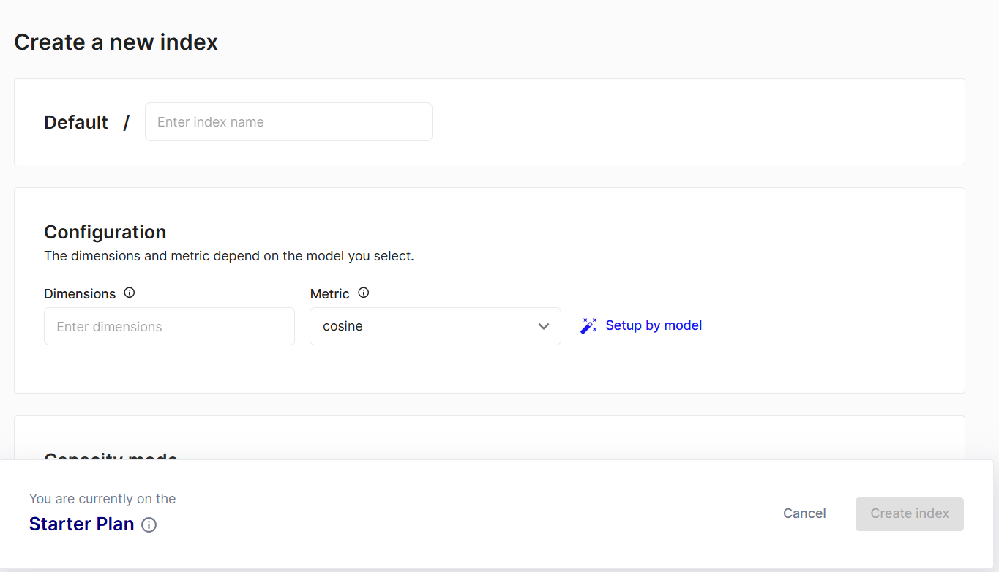
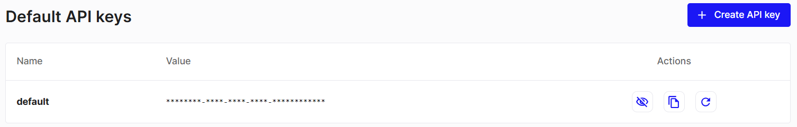

# Hybrid Search with Pinecone
## Overview
This repository demonstrates a hybrid search implementation using Pinecone. The hybrid search leverages both dense and sparse vector representations to enhance search results. This approach combines the strengths of dense embeddings (like those from neural networks) with sparse embeddings (such as those from traditional text representations) to improve search accuracy and relevance.
## Table of Contents
- [Requirements](#Requirements)
- [Installation](#Installation)
- [Dataset](#Dataset)
- [Library](#Library)
- [Example](#Example)
- [Contributing](#Contributing)
- [References](#References)

  ## Installation
```bash
git clone https://github.com/baodangtrandev/Hybrid-Search
cd Hybrid-Search
```
If you don't have requirements library, try to install them. Easy to install necessary library:
```bash
pip install -r requirements.txt
```
If you don't have jupyter notebook, please install:
```bash
pip install --user jupyterlab
```
Connect to Jupyter Lab:
```bash
jupyter notebook
```

## Requirements
- Python 3.6+
- Pinecone database [(Setup)](#Setup-Pinecone-Database)
- Necessary Library
- Jupyter NoteBook

## Dataset
I use [pubmed_qa](https://huggingface.co/datasets/qiaojin/PubMedQA) dataset on on Hugging Face Datasets. I download it like so:
```bash
!pip install datasets
from datasets import load_dataset
pubmed = load_dataset(
   'pubmed_qa',
   'pqa_labeled',
   split='train'
)
```
## Library
You need install some library to run model:
 - [Dataset Hugging Face library](https://github.com/huggingface/datasets)
 - [Transformers library](https://github.com/huggingface/transformers)
 - [rank-bm25 library](https://github.com/dorianbrown/rank_bm25)
 - [Sentence Transformers library](https://github.com/UKPLab/sentence-transformers)
 - [Pinecone Client library](https://github.com/pinecone-io/pinecone-python-client)
 - [Tqdm library](https://github.com/tqdm/tqdm)

## Setup Pinecone Database
1. Access to pinecone [website](https://www.pinecone.io/)
2. Sign Up and Login to Pinecone Database
3. Create your index then select your provider and region:
   
4. Get your API keys your access to Manage/API-keys:
   
5. Copy index and your API keys and add to your code

## Example
- I have an question and want to test hybrid search system with **top_k = 3** (3 best recommend answers), **aplha = 1** (only using dense search):
```bash
question = "Can clinicians use the PHQ-9 to assess depression in people with vision loss?"
hybrid_query(question, top_k=3, alpha=1)
```
Output:
```shell
{'matches': [{'id': '305',
              'metadata': {'context': 'The gap between evidence-based '
                                      'treatments and routine care has been '
                                      'well established. Findings from the '
                                      'Sequenced Treatments Alternatives to '
                                      'Relieve Depression (STAR*D) emphasized '
                                      'the importance of measurement-based '
                                      'care for the treatment of depression as '
                                      'a key ingredient for achieving response '
                                      'and remission; yet measurement-based '
                                      'care approaches are not commonly used '
                                      'in clinical practice.\n'
                                      'The Nine-Item Patient Health '
                                      'Questionnaire (PHQ-9) for monitoring '
                                      'depression severity was introduced in '
                                      '19 diverse psychiatric practices. '
                                      'During the one-year course of the '
                                      'project the helpfulness and feasibility '
                                      'of implementation of PHQ-9 in these '
                                      'psychiatric practices were studied. The '
                                      'project was modeled after the Institute '
                                      'for Healthcare Improvement Breakthrough '
                                      'Series. Two of the 19 practices dropped '
                                      'out during the course of the project.\n'
                                      'By the conclusion of the study, all '
                                      'remaining 17 practices had adopted '
                                      'PHQ-9 as a routine part of depression '
                                      'care in their practice. On the basis of '
                                      'responses from 17 psychiatrists from '
                                      'those practices, PHQ-9 scores '
                                      'influenced clinical decision making for '
                                      '93% of 6,096 patient contacts. With the '
                                      'additional information gained from the '
                                      'PHQ-9 score, one or more treatment '
                                      'changes occurred during 40% of these '
                                      'clinical contacts. Changing the dosage '
                                      'of antidepressant medication and adding '
                                      'another medication were the most common '
                                      'treatment changes recorded by '
                                      'psychiatrists, followed by starting or '
                                      'increasing psychotherapy and by '
                                      'switching or initiating '
                                      'antidepressants. In 3% of the patient '
                                      'contacts, using the PHQ-9 led to '
                                      'additional suicide risk assessment.'},
              'score': 0.732677519,
              'values': []},
             {'id': '711',
              'metadata': {'context': 'To investigate whether the Patient '
                                      'Health Questionnaire-9 (PHQ-9) '
                                      'possesses the essential psychometric '
                                      'characteristics to measure depressive '
                                      'symptoms in people with visual '
                                      'impairment.\n'
                                      'The PHQ-9 scale was completed by 103 '
                                      'participants with low vision. These '
                                      'data were then assessed for fit to the '
                                      'Rasch model.\n'
                                      "The participants' mean +/- standard "
                                      'deviation (SD) age was 74.7 +/- 12.2 '
                                      'years. Almost one half of them (n = 46; '
                                      '44.7%) were considered to have severe '
                                      'vision impairment (presenting visual '
                                      'acuity<6/60 in the better eye). '
                                      'Disordered thresholds were evident '
                                      'initially. Collapsing the two middle '
                                      'categories produced ordered thresholds '
                                      'and fit to the Rasch model (chi = 10.1; '
                                      'degrees of freedom = 9; p = 0.34). The '
                                      'mean (SD) items and persons Fit '
                                      'Residual values were -0.31 (1.12) and '
                                      '-0.25 (0.78), respectively, where '
                                      'optimal fit of data to the Rasch model '
                                      'would have a mean = 0 and SD = 1. '
                                      'Unidimensionality was demonstrated '
                                      'confirming the construct validity of '
                                      'the PHQ-9 and there was no evidence of '
                                      'differential item functioning on a '
                                      'number of factors including visual '
                                      'disability. The person separation '
                                      'reliability value was 0.80 indicating '
                                      'that the PHQ-9 has satisfactory '
                                      'precision. There was a degree of '
                                      'mistargeting as expected in this '
                                      'largely non-clinically depressed '
                                      'sample.'},
              'score': 0.696874142,
              'values': []},
             {'id': '735',
              'metadata': {'context': 'To assess whether perspective-taking, '
                                      'which researchers in other fields have '
                                      'shown to induce empathy, improves '
                                      'patient satisfaction in encounters '
                                      'between student-clinicians and '
                                      'standardized patients (SPs).\n'
                                      'In three studies, randomly assigned '
                                      'students (N = 608) received either a '
                                      'perspective-taking instruction or a '
                                      'neutral instruction prior to a clinical '
                                      'skills examination in 2006-2007. SP '
                                      'satisfaction was the main outcome in '
                                      'all three studies. Study 1 involved 245 '
                                      'third-year medical students from two '
                                      'universities. Studies 2 and 3 extended '
                                      'Study 1 to examine generalizability '
                                      'across student and SP subpopulations. '
                                      'Study 2 (105 physician assistant '
                                      'students, one university) explored the '
                                      'effect of perspective-taking on African '
                                      "American SPs' satisfaction. Study 3 "
                                      '(258 third-year medical students, two '
                                      'universities) examined the '
                                      "intervention's effect on students with "
                                      'high and low baseline '
                                      'perspective-taking tendencies.\n'
                                      'Intervention students outscored '
                                      'controls in patient satisfaction in all '
                                      'studies: Study 1: P = .01, standardized '
                                      'effect size = 0.16; Study 2: P = .001, '
                                      'standardized effect size = 0.31; Study '
                                      '3: P = .009, standardized effect size = '
                                      '0.13. In Study 2, perspective-taking '
                                      "improved African American SPs' "
                                      'satisfaction. In Study 3, intervention '
                                      'students with high baseline '
                                      'perspective-taking tendencies outscored '
                                      'controls (P = .0004, standardized '
                                      'effect size = 0.25), whereas those with '
                                      'low perspective-taking tendencies did '
                                      'not (P = .72, standardized effect size '
                                      '= 0.00).'},
              'score': 0.505706966,
              'values': []}],
 'namespace': '',
 'usage': {'read_units': 6}}
```
- When **alpha = 0.0**, we only use sparse search:
```bash
question = "Can clinicians use the PHQ-9 to assess depression in people with vision loss?"
hybrid_query(question, top_k=3, alpha=0)
```
```shell
{'matches': [{'id': '994',
              'metadata': {'context': 'Although desflurane is commonly used to '
                                      'control surgically induced '
                                      'hypertension, its effects on left '
                                      'ventricular (LV) function have not been '
                                      'investigated in this clinical '
                                      'situation. The purpose of the present '
                                      'study was to evaluate the LV function '
                                      'response to desflurane, when used to '
                                      'control intraoperative hypertension.\n'
                                      'In 50 patients, scheduled for vascular '
                                      'surgery, anesthesia was induced with '
                                      'sufentanil 0.5 microg/kg, midazolam 0.3 '
                                      'mg/kg and atracurium 0.5 mg/kg. After '
                                      'tracheal intubation, anesthesia was '
                                      'maintained with increments of drugs '
                                      'with controlled ventilation '
                                      '(N2O/O2=60/40%) until the start of '
                                      'surgery. A 5 Mhz transesophageal '
                                      'echocardiography (TEE) probe was '
                                      'inserted after intubation. Pulmonary '
                                      'artery catheter and TEE measurements '
                                      'were obtained after induction '
                                      '(to)(control value), at surgical '
                                      'incision (t1) if it was associated with '
                                      'an increase in systolic arterial '
                                      'pressure (SAP) greater than 140 mmHg '
                                      '(hypertension) and after control of '
                                      'hemodynamic parameters by '
                                      'administration of desflurane (return of '
                                      'systolic arterial pressure to within '
                                      '20% of the control value) (t2) in a '
                                      'fresh gas flow of 31/ min.\n'
                                      'Sixteen patients developed hypertension '
                                      'at surgical incision. SAP was '
                                      'controlled by desflurane in all 16 '
                                      'patients. Afterload assessed by '
                                      'systemic vascular resistance index '
                                      '(SVRI), end-systolic wall-stress (ESWS) '
                                      'and left-ventricular stroke work index '
                                      '(LVSWI) increased with incision until '
                                      'the hypertension returned to '
                                      'post-induction values with mean '
                                      'end-tidal concentration of 5.1+/-0.7% '
                                      'desflurane. No change in heart rate, '
                                      'cardiac index, mean pulmonary arterial '
                                      'pressure, stroke volume, end-diastolic '
                                      'and end-systolic cross-sectional areas, '
                                      'fractional area change and left '
                                      'ventricular circumferential fiber '
                                      'shortening was noted when desflurane '
                                      'was added to restore blood pressure.'},
              'score': 0.0,
              'values': []},
             {'id': '992',
              'metadata': {'context': 'Anteroposterior, lateral, and right and '
                                      'left oblique lumbar spine radiographs '
                                      'are often a standard part of the '
                                      'evaluation of children who are '
                                      'clinically suspected of having '
                                      'spondylolysis. Recent concerns '
                                      'regarding radiation exposure and costs '
                                      'have brought the value of oblique '
                                      'radiographs into question. The purpose '
                                      'of the present study was to determine '
                                      'the diagnostic value of oblique views '
                                      'in the diagnosis of spondylolysis.\n'
                                      'Radiographs of fifty adolescents with '
                                      'L5 spondylolysis without '
                                      'spondylolisthesis and fifty controls '
                                      'were retrospectively reviewed. All '
                                      'controls were confirmed not to have '
                                      'spondylolysis on the basis of computed '
                                      'tomographic scanning, magnetic '
                                      'resonance imaging, or bone scanning. '
                                      'Anteroposterior, lateral, and right and '
                                      'left oblique radiographs of the lumbar '
                                      'spine were arranged into two sets of '
                                      'slides: one showing four views '
                                      '(anteroposterior, lateral, right '
                                      'oblique, and left oblique) and one '
                                      'showing two views (anteroposterior and '
                                      'lateral only). The slides were randomly '
                                      'presented to four pediatric spine '
                                      'surgeons for diagnosis, with four-view '
                                      'slides being presented first, followed '
                                      'by two-view slides. The slides for '
                                      'twenty random patients were later '
                                      'reanalyzed in order to calculate of '
                                      'intra-rater agreement. A power analysis '
                                      'demonstrated that this study was '
                                      'adequately powered. Inter-rater and '
                                      'intra-rater agreement were assessed on '
                                      'the basis of the percentage of overall '
                                      'agreement and intraclass correlation '
                                      'coefficients (ICCs). PCXMC software was '
                                      'used to generate effective radiation '
                                      'doses. Study charges were determined '
                                      'from radiology billing data.\n'
                                      'There was no significant difference in '
                                      'sensitivity and specificity between '
                                      'four-view and two-view radiographs in '
                                      'the diagnosis of spondylolysis. The '
                                      'sensitivity was 0.59 for two-view '
                                      'studies and 0.53 for four-view studies '
                                      '(p = 0.33). The specificity was 0.96 '
                                      'for two-view studies and 0.94 for '
                                      'four-view studies (p = 0.60). '
                                      'Inter-rater agreement, intra-rater '
                                      'agreement, and agreement with '
                                      'gold-standard ICC values were in the '
                                      'moderate range and also demonstrated no '
                                      'significant differences. Percent '
                                      'overall agreement was 78% for four-view '
                                      'studies and 82% for two-view studies. '
                                      'The radiation effective dose was 1.26 '
                                      'mSv for four-view studies and 0.72 mSv '
                                      'for two-view studies (difference, 0.54 '
                                      'mSv). The charge for four-view studies '
                                      'was $145 more than that for two-view '
                                      'studies.'},
              'score': 0.0,
              'values': []},
             {'id': '993',
              'metadata': {'context': 'An unknown number of colorectal cancers '
                                      'could be due to missed adenomas during '
                                      'previous endoscopy. Data in the '
                                      'literature are sparse. A large '
                                      'cross-sectional study was done in a '
                                      'prospective database of all patients '
                                      'diagnosed with colorectal cancer.\n'
                                      'All consecutive endoscopies over a '
                                      'period of 15 years, in which colorectal '
                                      'cancer was diagnosed were included. All '
                                      'patients who underwent more than one '
                                      'endoscopy and in whom ultimately cancer '
                                      'was diagnosed were studied separately.\n'
                                      'Colorectal cancer was diagnosed in 835 '
                                      'patients. Twenty-five patients '
                                      'underwent a previous endoscopy without '
                                      'a cancer diagnosis. These 25 patients '
                                      'were divided into three groups '
                                      'according to the time between the '
                                      'endoscopy in which the cancer was '
                                      'detected and the previous endoscopy. '
                                      'Five out of these 25 patients underwent '
                                      'regular surveillance. Only 11 patients '
                                      'had no argument for regular follow-up. '
                                      'Assuming that these cancers developed '
                                      'from an adenoma than only 11 out of 835 '
                                      '(1.3%) cancers were missed in the '
                                      'adenoma phase. There was no difference '
                                      'in the size of the tumour between the '
                                      'three groups of patients.'},
              'score': 0.0,
              'values': []}],
 'namespace': '',
 'usage': {'read_units': 6}}
```
## Contributing

We welcome contributions to this project and are excited to collaborate with the community. To ensure a smooth process, please follow these guidelines:

### How to Contribute

1. **Fork the repository**: Click the "Fork" button at the top right corner of this page to create a copy of the repository under your own GitHub account.

2. **Clone your fork**: Use the following command to clone your forked repository to your local machine.
    ```shell
    git clone https://github.com/baodangtrandev/Hybrid-Search.git
    ```

3. **Create a branch**: Before making any changes, create a new branch for your contribution. Use a descriptive name for your branch.
    ```shell
    git checkout -b feature/main
    ```

4. **Make your changes**: Implement your changes in the new branch. Ensure your code follows the project's style and conventions.

5. **Commit your changes**: Once your changes are ready, commit them with a descriptive commit message.
    ```shell
    git add .
    git commit -m "Add a descriptive commit message"
    ```

6. **Push to your fork**: Push your branch to your forked repository on GitHub.
    ```shell
    git push origin feature/main
    ```

7. **Create a Pull Request**: Navigate to the original repository and click the "New Pull Request" button. Compare your branch with the original repository's main branch and submit the pull request with a description of your changes.

### Code Style

- Follow the existing code style and conventions.
- Write clear and concise commit messages.
- Include comments and documentation where necessary.

### Reporting Issues

If you find any bugs or have suggestions for improvements, please open an issue on GitHub. Provide as much detail as possible to help us understand and resolve the issue.


Thank you for your contributions! We look forward to collaborating with you.

## References
1. James Briggs. Getting Started with Hybrid Search (2023). [Access](https://www.pinecone.io/learn/hybrid-search-intro/).
2. Pinecone Docs. [Access](https://docs.pinecone.io/home)
3. Meredith Syed. Erika Russi. What is vector search? (June 2024). [Access](https://www.ibm.com/topics/vector-search)
4. James Briggs. SPLADE for Sparse Vector Search Explained (June 2023). [Access](https://www.pinecone.io/learn/splade/)

   


